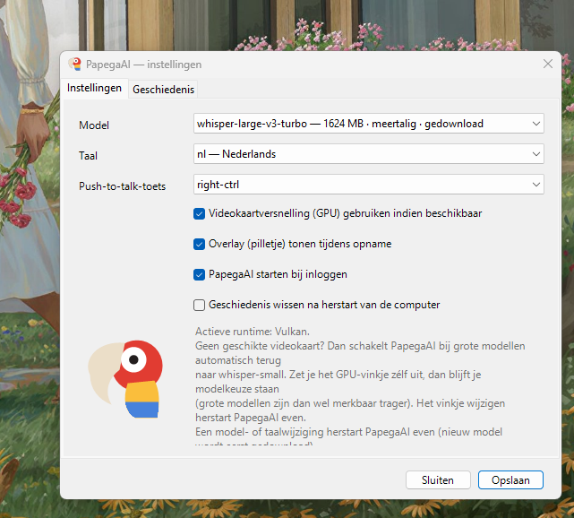

# PapegaAI

Push-to-talk dictation that runs entirely on your own machine: hold a key,
speak, release, and the transcript is typed in wherever the cursor is. A port
of the macOS original [digimata/parrot](https://github.com/digimata/parrot) to
Windows and Linux.



```
PapegaAI.sln
├── PapegaAI.Core/     platform-neutral: config, models, whisper, history, DSP
├── PapegaAI/          Windows app — WinForms tray, WASAPI, SendInput, installer
└── PapegaAI.Linux/    Linux app — Avalonia tray, ALSA, evdev/X RECORD, uinput
```

Both builds share `PapegaAI.Core`, so a fix to model handling, transcription or
the history store lands on both at once. Everything that touches the operating
system sits behind five small interfaces in
[`PapegaAI.Core/Platform`](PapegaAI.Core/Platform) — capture, hotkey, injection,
autostart — and each app supplies its own implementations.

The config file format is identical on both, and the settings live in the
platform's usual spot (`%LOCALAPPDATA%\PapegaAI` · `~/.config/PapegaAI` +
`~/.local/share/PapegaAI`).

## Getting started

- **Windows** — [PapegaAI/README.md](PapegaAI/README.md). Build the installer
  with Inno Setup, or run the portable build.
- **Linux** — [PapegaAI.Linux/README.md](PapegaAI.Linux/README.md). Run
  `build-linux.sh`, copy the tarball over, run `install.sh`.

Both need the [.NET 8 SDK](https://dotnet.microsoft.com/download/dotnet/8.0) to
build, and neither needs anything installed on the target machine: the shipped
builds are self-contained.

## How the platforms differ

| Concern | macOS (original) | Windows | Linux |
|---|---|---|---|
| Language | Swift (SPM) | C# (.NET 8) | C# (.NET 8) |
| Transcription | WhisperKit / CoreML | Whisper.net — Vulkan or CPU | Whisper.net — Vulkan or CPU |
| Mic capture | AVAudioEngine | WASAPI (NAudio) | ALSA, or parec/pw-record/arecord |
| Global hotkey | CGEventTap on `fn` | low-level keyboard hook | X RECORD, or evdev |
| Text injection | CGEvent unicode | `SendInput` unicode | xdotool / wtype / uinput + clipboard |
| UI | SwiftUI + NSStatusItem | WinForms + NotifyIcon | Avalonia + StatusNotifierItem |
| Launch at login | LaunchAgent plist | HKCU `…\Run` | XDG autostart entry |
| Single instance | — | named mutex | `flock` in `$XDG_RUNTIME_DIR` |

Transcription is local on every platform; audio never leaves the machine.

## Credits and licence

The idea, the interaction design and the original implementation are
[Andrew Jones' parrot](https://github.com/digimata/parrot) for macOS. This
repository is an independent reimplementation of that daemon in C#, not a fork
of the Swift code — the two share no source, only a design.

Both are MIT licensed; see [LICENSE](LICENSE). Whisper models come from
[ggerganov/whisper.cpp](https://huggingface.co/ggerganov/whisper.cpp) and are
downloaded on first run, never bundled.
